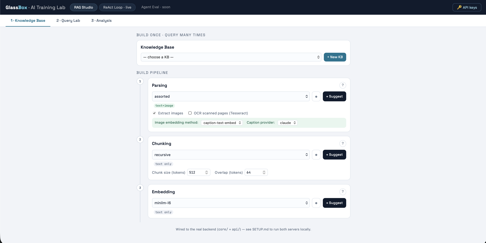
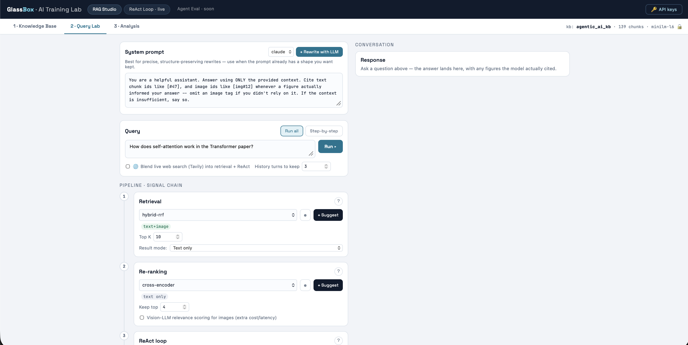
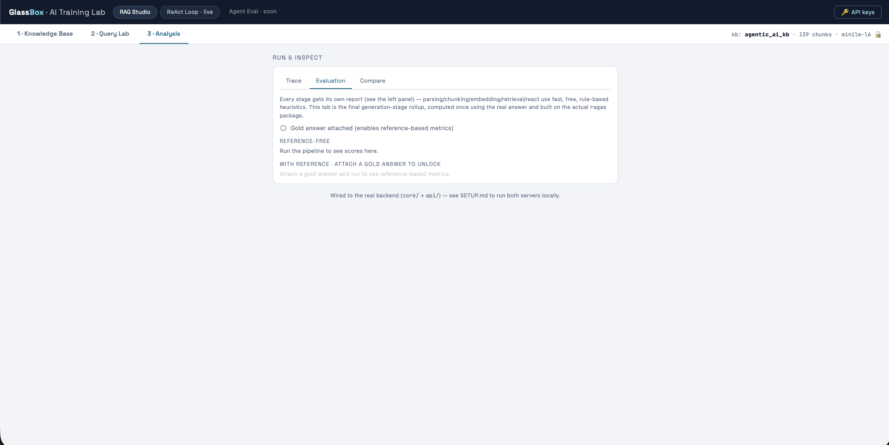

# GlassBox

GlassBox is a "glass-box" RAG (Retrieval-Augmented Generation) training lab:
a full retrieval + generation pipeline where every stage — parsing,
chunking, embedding, retrieval, reranking, generation — is inspectable,
swappable, and evaluated on its own, instead of hiding behind a single
"ask a question, get an answer" black box.

It ships as three things that share one Python core (`core/`):

- **A FastAPI backend** (`api/`) that streams pipeline progress and stage
  reports over SSE, backs a real vector store, and serves the query/analysis
  endpoints.
- **A React UI** (`frontend/`) — build a Knowledge Base, configure each
  pipeline stage, run queries, and inspect the trace/evaluation/cost of
  every run.
- **A CLI** (`cli/`) — the same pipeline, runnable standalone with no UI or
  server, stage-by-stage or all at once.

## What the pipeline does

1. **Parsing** — PDF, DOCX, PPTX, Markdown, and plain text, with optional
   image extraction and Tesseract OCR for scanned pages.
2. **Chunking** — fixed-size, recursive, sentence-aware, markdown-heading-aware,
   or embedding-similarity-based semantic chunking.
3. **Embedding** — local (MiniLM, BGE-small/M3) or hosted (Gemini,
   OpenAI `text-embedding-3-*`) text embeddings, plus a separate image
   pipeline (caption-then-embed, or local CLIP).
4. **Vector store** — Chroma, with separate text and image collections
   sharing a `doc_id`.
5. **Retrieval** — semantic, keyword (BM25), or hybrid (Reciprocal Rank
   Fusion), with an optional live web search (Tavily) blended in.
6. **Reranking** — passthrough or a local cross-encoder.
7. **ReAct loop** (optional) — an LLM judge (Claude, Gemini, GPT-4o-mini, or
   Groq/Llama) critiques the retrieved context and can trigger another
   retrieval pass before generation.
8. **Generation** — Claude, Gemini, GPT-4o-mini, or Groq/Llama models.
9. **Evaluation**, at every stage:
   - Parsing/chunking/embedding/retrieval get **zero-cost heuristic
     reports** (`core/evaluation/heuristics.py`) — no LLM tokens spent.
   - Generation gets real **RAGAS metrics** (`core/evaluation/ragas_eval.py`):
     Faithfulness, AnswerRelevancy, ContextPrecision reference-free, plus
     ContextRecall/AnswerCorrectness/SemanticSimilarity if a gold answer is
     supplied.

Every stage's method registry is discoverable at runtime — run
`python -m cli.main show-registry` or hit `GET /registry` on the backend.

## Codebase layout

```
core/
  pipeline.py           # orchestrator: run_<stage>() individually, or run_all()
  pipeline_config.py    # every stage's configurable options, in one place
  schemas.py            # StageReport: {output, trace, eval_*, acknowledged}
  registry.py            # @register("stage", "method") decorator + lookup
  tokenizer.py            # ~4-chars/token approximation, no network dependency
  llm_clients.py           # one interface for Claude/Gemini/OpenAI/Groq: chat(),
                            # caption_image(), rewrite_system_prompt(), suggest_option()
  react_loop.py            # the optional judge-critiques-context refinement loop
  web_search.py            # Tavily integration, degrades gracefully without a key
  kb_store.py              # Knowledge Base persistence (metadata + uploads + assets)

  parsing/      # pdf, docx, pptx, md, txt + OCR, "assorted" auto-dispatches by extension
  chunking/     # fixed, recursive, sentence, markdown_structure, semantic
  embedding/    # text_local (MiniLM/BGE), text_gemini, text_openai, image_caption
  vectorstore/  # chroma_store.py
  retrieval/    # semantic, keyword (BM25), hybrid_rrf, multimodal result-mode logic
  reranking/    # none (passthrough), cross-encoder
  generation/   # thin per-provider wrappers over llm_clients
  judge/        # per-provider judges used by the ReAct loop
  evaluation/   # heuristics.py (free) + ragas_eval.py (real RAGAS) + diagnosis.py

api/main.py     # FastAPI app: KB build/list/delete, query (SSE), rewrite/suggest, diagnose
cli/main.py     # parse | chunk | run [--step] | show-registry

frontend/src/
  RAGLab.jsx    # the whole UI: Knowledge Base tab, Query Lab tab, Analysis tab
  api.js        # fetch wrappers for every backend endpoint
```

## Running it

### Prerequisites

| | macOS | Windows |
|---|---|---|
| Python | 3.11 | 3.11 |
| Node.js | 18+ | 18+ |
| Tesseract (OCR) | `brew install tesseract` | [installer](https://github.com/UB-Mannheim/tesseract/wiki), add its dir to PATH |
| [uv](https://docs.astral.sh/uv/) | `brew install uv` | `pip install uv` or the [installer](https://docs.astral.sh/uv/getting-started/installation/) |

### Backend

```bash
uv venv --python 3.11
source .venv/bin/activate      # Windows: .venv\Scripts\Activate.ps1

uv pip install -r requirements.txt

uvicorn api.main:app --reload --port 8000
```

Visit `http://127.0.0.1:8000/docs` for the Swagger UI, or
`http://127.0.0.1:8000/registry` to confirm every stage's methods loaded.

### Frontend

```bash
cd frontend
npm install
npm run dev
```

Visit `http://localhost:5173` — it talks to the backend at
`http://127.0.0.1:8000` by default (override with `VITE_API_BASE` in a
`frontend/.env` file).

### Using the UI

1. **Knowledge Base** — attach documents (PDF/DOCX/PPTX/MD/TXT), configure
   parsing/chunking/embedding, click **Build KB**. Stages stream in as they
   complete; a built KB is reusable across queries without re-embedding.
2. **Query Lab** — pick a KB, type a query, optionally toggle web search and
   the ReAct loop, click **Run**. Add provider API keys via the **API keys**
   button first.
3. **Analysis** — inspect the per-stage trace, evaluation reports, and
   token/cost breakdown for the run, or compare two runs side by side.

### CLI (no UI or server needed)

```bash
python -m cli.main show-registry
python -m cli.main run sample_corpus -q "How does self-attention work?" --claude-key sk-ant-...
python -m cli.main run sample_corpus -q "..." --claude-key sk-ant-... --step   # pause after each stage
python -m cli.main run sample_corpus -q "..." --claude-key sk-ant-... --web --tavily-key tvly-... --react
```

### Docker

```bash
docker compose up --build
```

Builds the backend (FastAPI + Chroma, `data/` mounted so KBs persist) and
the frontend (static build served via nginx). See `Dockerfile.backend`,
`Dockerfile.frontend`, `docker-compose.yml`. API keys are still typed into
the running UI or passed as environment variables at deploy time — never
baked into the image.

For platform-specific setup notes (OneDrive/synced-folder caveats, moving
KB data out of the repo, troubleshooting), see `SETUP.md`.

## Screenshots

**Knowledge Base — build pipeline**



**Query Lab**



**Analysis — trace/evaluation/compare**


